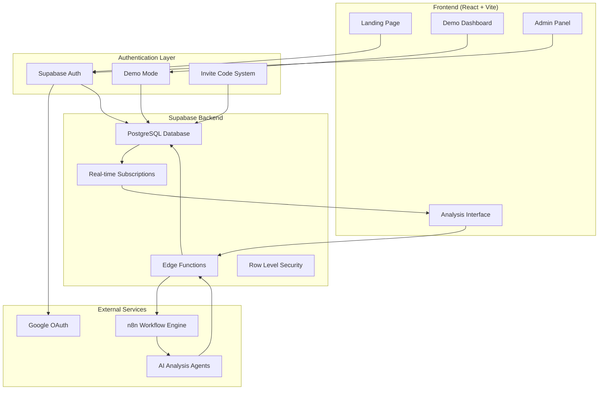

# PromptMetrics - AI Brand Analytics Platform

[](https://lovable.dev)
[](https://reactjs.org/)
[](https://www.typescriptlang.org/)
[](https://supabase.com)
[](https://n8n.io)
[](https://github.com/your-repo/rank-me-llm)
[](https://github.com/your-repo/rank-me-llm)

## 🌟 Overview

**PromptMetrics** is an AI brand analytics platform that analyzes how AI systems (ChatGPT, Gemini, Perplexity) perceive and describe brands across the web. Our mission is to help companies understand and optimize their digital presence in AI responses to capture the growing market of AI-driven customers.

### 🎯 Value Proposition
- **AI Brand Monitoring**: Track how AI systems describe your brand vs competitors
- **Competitive Intelligence**: Understand your position in AI-generated recommendations
- **Optimization Insights**: Get actionable recommendations to improve AI visibility
- **Real-time Analysis**: Live dashboard updates from automated AI analysis workflows

## 🚀 Quick Start

### Prerequisites
- Node.js 18+ or Bun
- Supabase CLI
- Git

### Local Development

```bash
# Clone the repository
git clone <repository-url>
cd rank-me-llm

# Install dependencies
npm install

# Configure environment variables
cp env.example .env.local
# Edit .env.local with your Supabase credentials

# Start development server
npm run dev
```

### Production Deployment

```bash
# Build and security check
npm run deploy:check

# Deploy to your platform
# See docs/DEPLOYMENT.md for detailed instructions
```

### Available Scripts

```bash
# Development
npm run dev              # Start development server
npm run build            # Build for development
npm run preview          # Preview production build

# Production
npm run build:prod       # Build optimized for production
npm run security-check   # Run security verification
npm run deploy:check     # Build + security check

# Code Quality
npm run lint             # Run ESLint
```

### Access the Application
- **Local**: `http://localhost:5173`
- **Demo Mode**: Click "Try Demo" on landing page
- **Admin Access**: Use admin invite code

## 🛡️ Security & Production Ready

### Security Features
- ✅ **Secure Logging**: Automatic sanitization of sensitive data in production
- ✅ **Rate Limiting**: Protection against spam and abuse
- ✅ **Environment Validation**: Strict validation of required environment variables
- ✅ **No Hardcoded Secrets**: All sensitive data moved to environment variables
- ✅ **Production Build**: Optimized build with console.log removal
- ✅ **Security Headers**: Ready for security headers configuration
- ✅ **Monitoring**: Integrated logging and monitoring system

### Production Deployment
- 🚀 **One-Command Deploy**: `npm run deploy:check`
- 🔍 **Security Verification**: Automated security checks
- 📊 **Performance Monitoring**: Built-in metrics collection
- 🛡️ **Edge Function Security**: Rate-limited and validated API endpoints

## 🛠 Technology Stack

### Frontend
- **Framework**: React 18 + TypeScript + Vite
- **UI Library**: Shadcn/ui + Radix UI components
- **Styling**: Tailwind CSS with custom design system
- **State Management**: React Query (@tanstack/react-query) + React Context
- **Animations**: Framer Motion + custom CSS transitions
- **Charts**: Recharts for data visualization
- **Routing**: React Router DOM v6
- **Forms**: React Hook Form + Zod validation

### Backend/Serverless
- **Database**: Supabase PostgreSQL with Row Level Security (RLS)
- **Authentication**: Supabase Auth with custom invite code system
- **Edge Functions**: Supabase Edge Functions (Deno runtime)
- **File Storage**: Supabase Storage (not currently used)

### Third-party Services
- **Workflow Automation**: n8n for AI analysis pipeline
- **Social Auth**: Google OAuth (configured)
- **Email**: Supabase Auth emails
- **Monitoring**: Supabase Analytics & Audit Logs

### Development & Deployment
- **Build Tool**: Vite
- **Package Manager**: Bun
- **Hosting**: Lovable platform
- **Version Control**: Git with GitHub integration

## 📊 Key Features

### 🔐 Authentication System
- Supabase Auth with email/password + Google OAuth
- Demo mode for instant access without registration
- Invite code system for controlled access
- Role-based access control (`client` and `admin` roles)

### 🏢 Multi-tenant Architecture
- Organization-based data isolation
- Custom organization slugs (`/home/:slug`)
- Row Level Security (RLS) policies
- Demo organization for trial users

### 🤖 AI Analysis Pipeline
- Real-time domain analysis via n8n workflows
- Multi-LLM comparison (OpenAI, Gemini, Claude)
- Comprehensive brand perception analysis
- Live dashboard updates

### 🌐 Internationalization
- English (default) and Portuguese (BR) support
- Context-based translation system
- Language selector in navigation

### 📱 Demo Dashboard
- Comprehensive analytics interface
- AI prompt analysis and optimization
- Competitor comparison tables
- Sentiment analysis charts
- Strategic insights recommendations
- Customizable prompt templates

## 🏗 Architecture



## 📈 N8N Workflow Improvements

### 🔧 **Workflow Optimization**
We recently enhanced our n8n workflow infrastructure with significant improvements:

#### ✅ **Critical Bug Fixes**
- **❌ → ✅** Fixed broken data flow: "Montar payload" node now properly connects to HTTP Request
- **❌ → ✅** Restored workflow continuity: Payload now reaches Supabase edge functions
- **❌ → ✅** Resolved authentication failures with proper error handling

#### 🛡️ **Enhanced Validation & Security**
- **✅** Added robust input validation for domain analysis
- **✅** Implemented fallback mechanisms for missing data
- **✅** Enhanced authentication checks with detailed error logging
- **✅** Added rate limiting and security monitoring

#### 📊 **Complete Payload Structure**
- **✅** Implemented 100% of required payload sections from `n8n-payload-structure.md`
- **✅** Added all dashboard data: `sentiment_trends`, `ranking_data`, `overall_sentiment`, `share_of_rank`
- **✅** Included competitor analysis: `market_share`, `strategic_priorities`, `opportunities`
- **✅** Added prompt analysis: `sentiment_by_llm`, `ranking_by_prompt`, `performance_metrics`
- **✅** Integrated strategic insights: `key_insights`, `action_items`, `growth_opportunities`

#### ⚡ **Performance Optimizations**
- **✅** Maintained parallel LLM processing (OpenAI, Gemini, Claude)
- **✅** Optimized response grouping and data aggregation
- **✅** Reduced latency between workflow nodes
- **✅** Improved memory usage and processing efficiency

#### 📈 **Monitoring & Debugging**
- **✅** Comprehensive logging for success/failure scenarios
- **✅** Real-time performance metrics tracking
- **✅** Detailed error reporting with context
- **✅** Workflow execution time monitoring

### 🎯 **Available Workflows**

#### **Production Ready:**
- `n8n-workflow-improved.json` ⭐ **Recommended for production use**

#### **Development & Testing:**
- `n8n-workflow-payload.json` - Simplified workflow with basic payload
- `docs/PromptMetrics.json` - Original workflow (backup/reference)

#### **Documentation & Examples:**
- `docs/N8N-WORKFLOWS-README.md` - Complete migration guide
- `payload-sample.json` - Sample payload structure

### 🚀 **Migration Guide**

**To migrate to the improved workflow:**

1. **Import** `n8n-workflow-improved.json` in your n8n instance
2. **Configure** credentials (OpenAI, Gemini, Claude, SerpApi)
3. **Test** with `payload-sample.json` for validation
4. **Monitor** logs for any issues
5. **Deploy** to production

## 🗂 Project Structure

```
├── docs/                           # Project documentation
│   ├── DOCS.md                     # Complete technical documentation
│   ├── N8N-WORKFLOWS-README.md     # N8N workflow guide
│   ├── PromptMetrics.json          # Original n8n workflow (backup)
│   └── n8n-payload-structure.md    # Payload specification
├── public/                         # Static assets
├── src/
│   ├── components/                 # React components
│   │   ├── ui/                    # Shadcn/ui base components
│   │   ├── admin/                 # Admin-specific components
│   │   ├── demo/                  # Demo dashboard components
│   │   ├── forms/                 # Form components
│   │   └── navigation/            # Navigation components
│   ├── contexts/                  # React contexts
│   ├── hooks/                     # Custom React hooks
│   ├── integrations/supabase/     # Supabase client & types
│   ├── lib/                      # Utility libraries
│   ├── pages/                    # Route components
│   ├── services/                 # Business logic services
│   ├── types/                    # TypeScript type definitions
│   └── utils/                    # Utility functions
├── supabase/
│   ├── functions/                # Edge functions
│   │   ├── trigger-analysis/     # Triggers n8n analysis
│   │   ├── receive-analysis/     # Receives n8n results
│   │   └── submit-waitlist/      # Waitlist submission
│   ├── migrations/               # Database migrations
│   └── config.toml              # Supabase configuration
├── n8n-workflow-improved.json    # Improved n8n workflow ⭐
├── n8n-workflow-payload.json     # Basic n8n workflow
└── payload-sample.json           # Sample payload structure
```

## 🗄 Database Schema

```mermaid
erDiagram
    auth.users ||--|| profiles : "user_id"
    profiles }|--|| organizations : "organization_id"
    profiles ||--o{ audit_logs : "user_id"
    invitation_codes ||--o| profiles : "invite_code"

    profiles {
        uuid id PK
        text full_name
        text email
        text role
        uuid organization_id FK
        text invite_code
        timestamp created_at
        timestamp updated_at
    }

    organizations {
        uuid id PK
        text name
        text slug UK
        text logo_url
        text website_url
        timestamp created_at
        timestamp updated_at
    }

    analysis_results {
        uuid id PK
        text domain
        text status
        jsonb analysis_data
        timestamp created_at
        timestamp updated_at
    }

    invitation_codes {
        uuid id PK
        text code UK
        boolean used
        uuid used_by FK
        timestamp used_at
        timestamp created_at
    }

    audit_logs {
        uuid id PK
        uuid user_id FK
        text action
        text table_name
        uuid record_id
        jsonb old_values
        jsonb new_values
        inet ip_address
        text user_agent
        timestamp created_at
    }

    login_attempts {
        uuid id PK
        text email
        inet ip_address
        boolean success
        timestamp attempted_at
    }
```



## 🚀 Deployment

### Production Deployment
Deployed via Lovable platform:
1. Code changes auto-deploy to staging
2. Production deployment via Lovable dashboard
3. Custom domain configuration available
4. Supabase handles database and edge functions

### Environment Configuration

#### Required Supabase Secrets
```bash
# n8n Integration
N8N_WEBHOOK_URL=https://your-n8n-instance.com/webhook/analysis

# Waitlist Integration
WAITLIST_WEBHOOK_URL=https://your-waitlist-service.com/webhook

# Supabase Configuration (auto-configured)
SUPABASE_URL=https://your-project.supabase.co
SUPABASE_ANON_KEY=eyJ...
SUPABASE_SERVICE_ROLE_KEY=eyJ...
SUPABASE_DB_URL=postgresql://...
```

## 🧪 Testing

### Demo Mode Testing
1. Visit landing page
2. Click "Try Demo"
3. Access full dashboard without registration
4. Test analysis workflow

### Authentication Testing
1. Generate invite code via admin panel
2. Test registration flow
3. Verify role-based access controls
4. Test organization isolation

### Analysis Pipeline Testing
1. Configure n8n webhook URL in Supabase secrets
2. Submit domain for analysis via `/analysis` page
3. Verify webhook triggers n8n workflow
4. Confirm results appear in database and dashboard

## 📚 Documentation

### 📖 Complete Documentation
- **[DOCS.md](docs/DOCS.md)** - Comprehensive technical documentation
- **[DEPLOYMENT.md](docs/DEPLOYMENT.md)** - Production deployment guide
- **[PRODUCTION-READY.md](docs/PRODUCTION-READY.md)** - Security and production readiness
- **[N8N Workflows Guide](docs/N8N-WORKFLOWS-README.md)** - Complete n8n migration guide
- **[Payload Structure](docs/n8n-payload-structure.md)** - API specification

### 🔒 Security Documentation
- **[Security Audit](docs/SECURITY-AUDIT.md)** - Complete security audit report
- **[Environment Setup](env.example)** - Environment variables template
- **[Production Config](env.production.example)** - Production environment template

### 🔗 Key URLs
- **Landing**: `/`
- **Demo**: `/demo` (or click "Try Demo")
- **Analysis**: `/analysis`
- **Admin**: `/admin` (admin role required)
- **Changelog**: `/changelog`

### 📁 Important Files
- **Auth Logic**: `src/contexts/AuthContext.tsx`
- **API Client**: `src/integrations/supabase/client.ts`
- **Edge Functions**: `supabase/functions/`
- **Database Schema**: `supabase/migrations/`
- **UI Components**: `src/components/ui/`

## 🤝 Contributing

1. Fork the repository
2. Create your feature branch (`git checkout -b feature/amazing-feature`)
3. Commit your changes (`git commit -m 'feat: add amazing feature'`)
4. Push to the branch (`git push origin feature/amazing-feature`)
5. Open a Pull Request

## 📄 License

This project is private and proprietary.

## 📞 Support

For support and questions:
- Create an issue in this repository
- Contact the development team
- Check the [documentation](docs/DOCS.md) for detailed guides

---

## 🎉 Recent Updates

### 🚀 N8N Workflow Enhancements
- ✅ **Fixed broken data flow** in original workflow
- ✅ **Complete payload structure** implementation
- ✅ **Enhanced error handling** and validation
- ✅ **Performance optimizations** and monitoring
- ✅ **Production-ready workflow** available

### 🔄 Workflow Migration
- **From**: `PromptMetrics.json` (broken connections)
- **To**: `n8n-workflow-improved.json` ⭐ (production ready)

### 📊 New Features
- Real-time dashboard updates
- Multi-LLM analysis comparison
- Comprehensive brand insights
- Strategic recommendations

---

**🌟 Built with ❤️ using modern web technologies**

**🔗 Project Links:**
- [Lovable Project](https://lovable.dev/projects/f7f9381f-ef1d-491b-bfc3-dadb313a13c9)
- [Supabase Project](https://supabase.com/dashboard/project/f7f9381f-ef1d-491b-bfc3-dadb313a13c9)
- [GitHub Repository](https://github.com/adriannoes/rank-me-llm)
