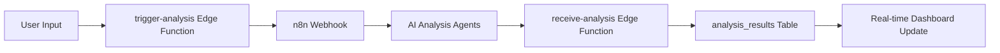
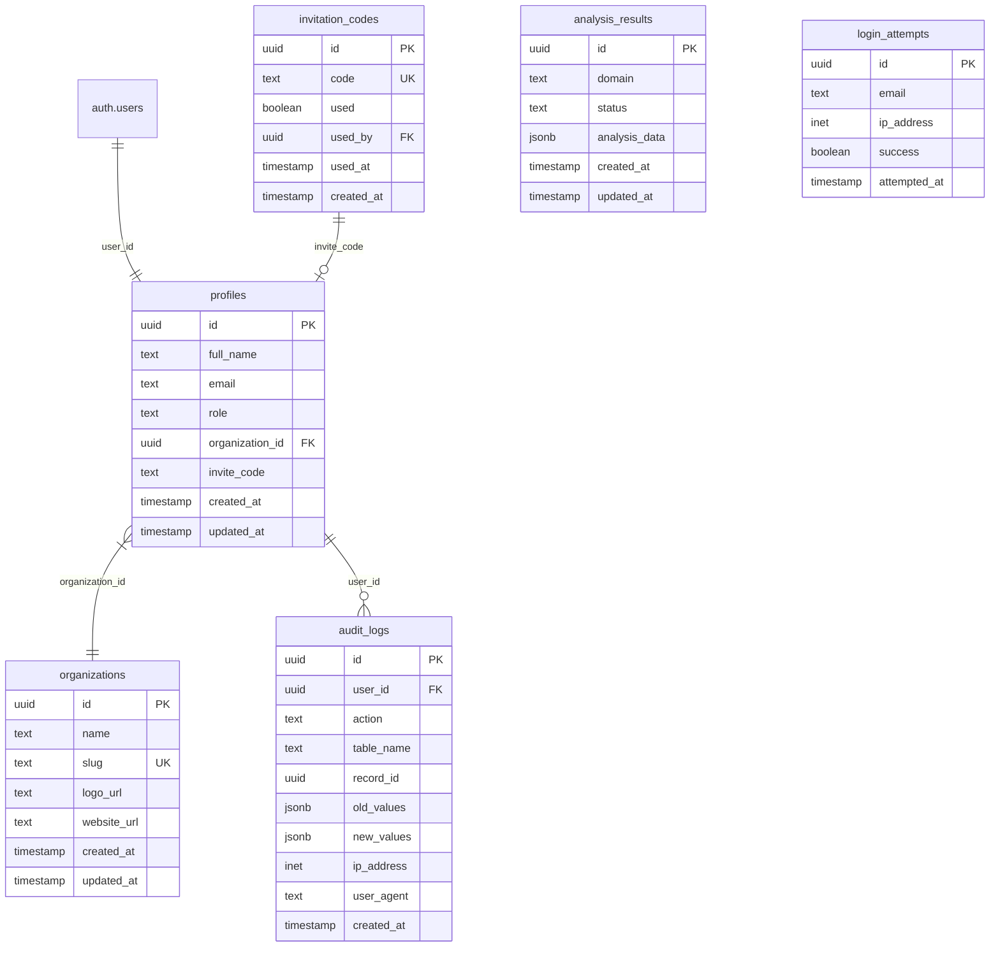
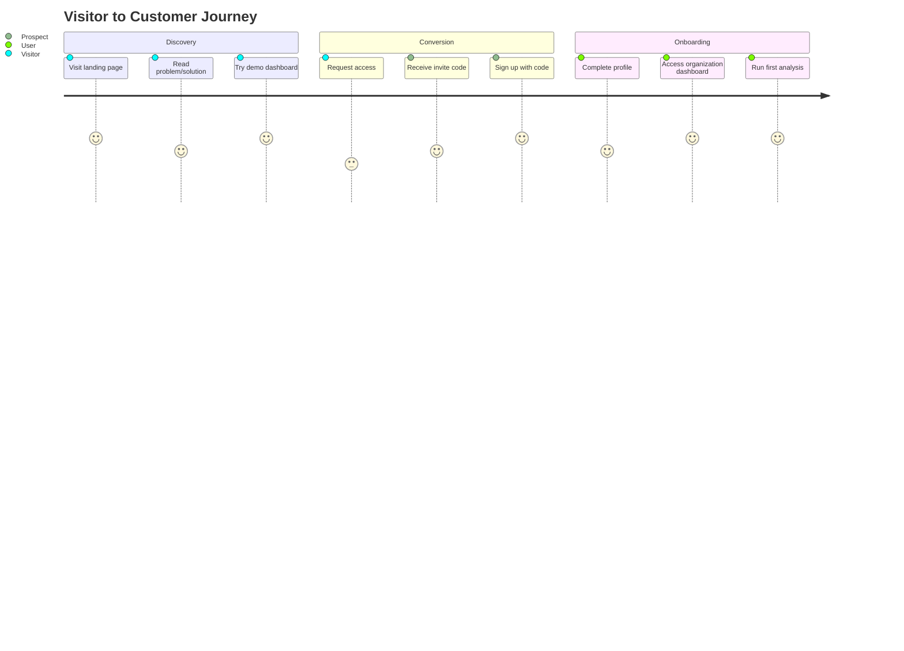
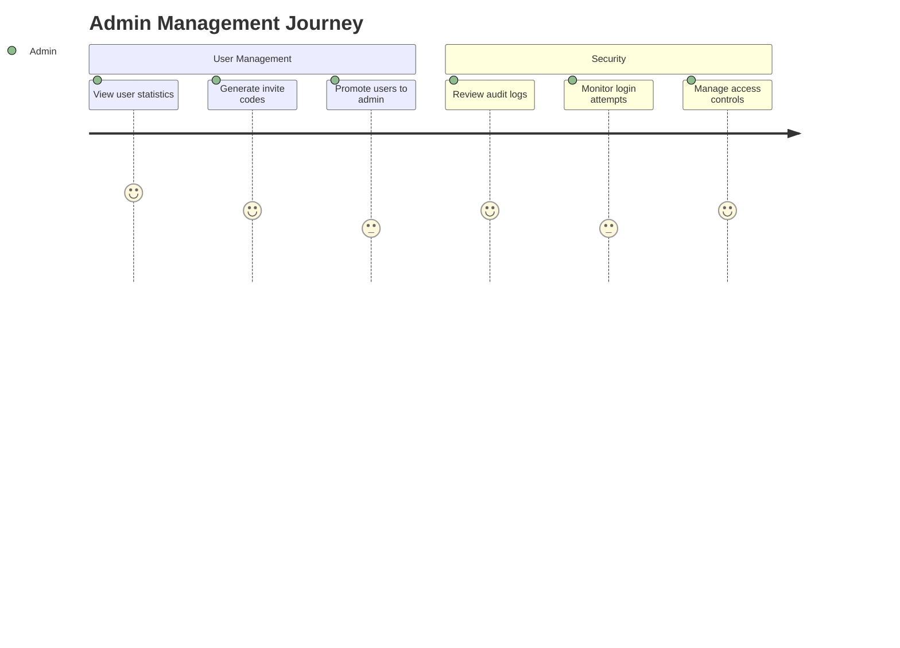
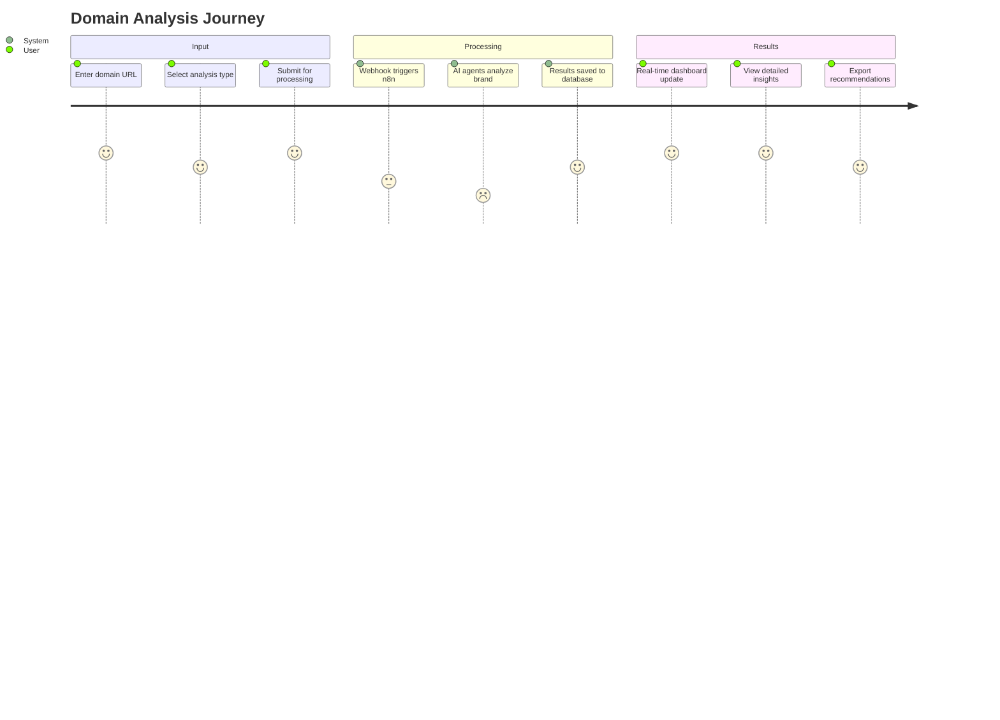
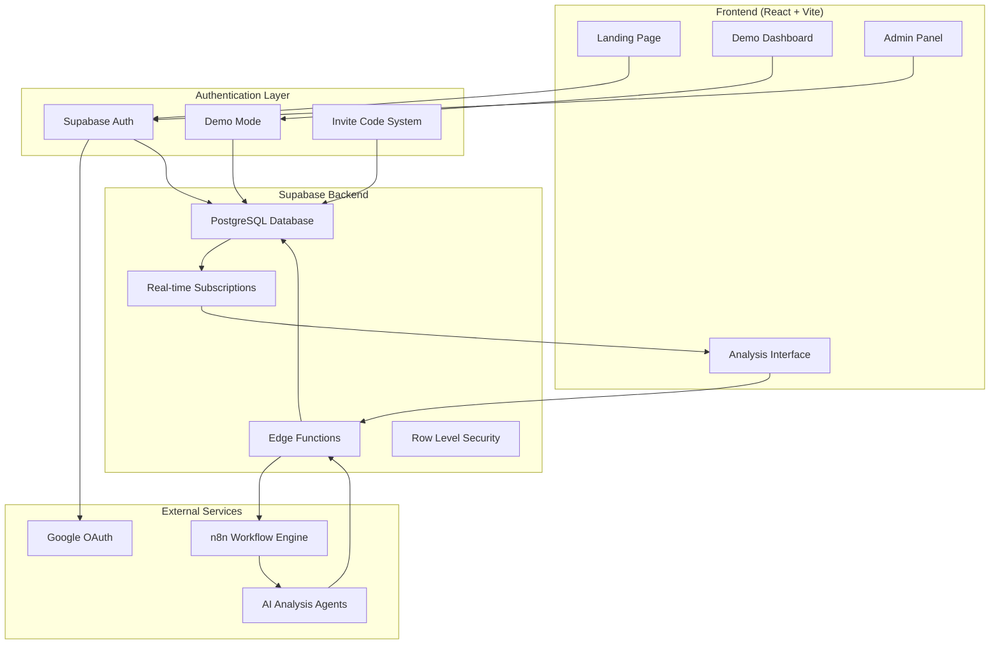

# PromptMetrics - Comprehensive Project Documentation

## 1. Project Overview

**PromptMetrics** is an AI brand analytics platform that analyzes how AI systems (ChatGPT, Gemini, Perplexity) perceive and describe brands across the web. Our mission is to help companies understand and optimize their digital presence in AI responses to capture the growing market of AI-driven customers.

### Value Proposition
- **AI Brand Monitoring**: Track how AI systems describe your brand vs competitors
- **Competitive Intelligence**: Understand your position in AI-generated recommendations  
- **Optimization Insights**: Get actionable recommendations to improve AI visibility
- **Real-time Analysis**: Live dashboard updates from automated AI analysis workflows

## 2. Technology Stack

### Frontend
- **Framework**: React 18 + TypeScript + Vite
- **UI Library**: Shadcn/ui + Radix UI components
- **Styling**: Tailwind CSS with custom design system
- **State Management**: React Query (@tanstack/react-query) + React Context
- **Animations**: Framer Motion + custom CSS transitions
- **Charts**: Recharts for data visualization
- **Routing**: React Router DOM v6
- **Forms**: React Hook Form + Zod validation

### Backend/Serverless
- **Database**: Supabase PostgreSQL with Row Level Security (RLS)
- **Authentication**: Supabase Auth with custom invite code system
- **Edge Functions**: Supabase Edge Functions (Deno runtime)
- **File Storage**: Supabase Storage (not currently used)

### Third-party Services
- **Workflow Automation**: n8n for AI analysis pipeline
- **Social Auth**: Google OAuth (configured)
- **Email**: Supabase Auth emails
- **Monitoring**: Supabase Analytics & Audit Logs

### Development & Deployment
- **Build Tool**: Vite
- **Package Manager**: Bun
- **Hosting**: Lovable platform
- **Version Control**: Git with GitHub integration

## 3. Folder Structure

```
├── docs/                           # Project documentation
├── public/                         # Static assets
├── src/
│   ├── components/                 # React components
│   │   ├── ui/                    # Shadcn/ui base components
│   │   ├── admin/                 # Admin-specific components
│   │   ├── demo/                  # Demo dashboard components
│   │   ├── forms/                 # Form components
│   │   └── navigation/            # Navigation components
│   ├── contexts/                  # React contexts
│   │   ├── AuthContext.tsx        # Authentication state
│   │   ├── LanguageContext.tsx    # i18n support
│   │   └── AccessibilityContext.tsx # Accessibility features
│   ├── hooks/                     # Custom React hooks
│   ├── integrations/
│   │   └── supabase/             # Supabase client & types
│   ├── lib/                      # Utility libraries
│   ├── pages/                    # Route components
│   ├── services/                 # Business logic services
│   ├── types/                    # TypeScript type definitions
│   └── utils/                    # Utility functions
├── supabase/
│   ├── functions/                # Edge functions
│   │   ├── trigger-analysis/     # Triggers n8n analysis
│   │   ├── receive-analysis/     # Receives n8n results
│   │   └── submit-waitlist/      # Waitlist submission
│   ├── migrations/               # Database migrations
│   └── config.toml              # Supabase configuration
└── tailwind.config.ts           # Tailwind configuration
```

## 4. Key Modules Explained

### Authentication Flow
The app uses a multi-tier authentication system:

1. **Supabase Auth**: Standard email/password + Google OAuth
2. **Demo Mode**: Skip authentication for demo users (`useDemoAuth`)
3. **Invite Code System**: Registration requires valid invitation codes
4. **Role-Based Access**: `client` and `admin` roles with different permissions

```typescript
// Authentication providers hierarchy
useAuthState() -> {
  demoUser || supabaseUser,
  demoSession || supabaseSession,
  demoProfile || supabaseProfile
}
```

### Organization Logic
Multi-tenant architecture with organization-based data isolation:

- Users belong to organizations via `profiles.organization_id`
- Organization routing: `/home/:slug` 
- RLS policies ensure users only see their organization's data
- Demo organization exists for trial users

### Analysis Pipeline
Domain analysis workflow via n8n integration:



### Internationalization (i18n)
- English (default) and Portuguese (BR) support
- Context-based translation system
- `LanguageContext` provides `t()` translation function
- Language selector in navigation

### Demo Dashboard
Comprehensive analytics interface with:
- AI prompt analysis and optimization
- Competitor comparison tables
- Sentiment analysis charts
- Strategic insights recommendations
- Customizable prompt templates

## 5. Data Model



### Key Database Functions
- `is_current_user_admin()`: Check admin privileges
- `consume_invitation_code()`: Mark invite codes as used
- `log_audit_event()`: Track security events
- `is_rate_limited()`: Prevent brute force attacks

## 6. User Journeys

### Visitor Journey


### Admin Journey


### Analysis Journey


## 7. Architecture Diagram



## 8. Important Decisions & Rationale

### Single Webhook vs Multiple
**Decision**: Use single `receive-analysis` webhook endpoint
**Rationale**: Simplifies n8n configuration and reduces complexity. All analysis types flow through one endpoint with JSONB payload differentiation.

### Supabase Realtime for Live Updates
**Decision**: Use Supabase real-time subscriptions for dashboard updates
**Rationale**: Provides instant feedback to users during analysis processing without polling or manual refresh.

### Invite-Only Registration
**Decision**: Require invitation codes for user registration
**Rationale**: Controlled growth, quality user base, and prevents spam registrations during beta phase.

### Demo Mode Authentication
**Decision**: Parallel demo authentication system alongside Supabase
**Rationale**: Allows visitors to experience full functionality without registration barriers, increasing conversion rates.

### Mobile-First + Glassmorphism Design
**Decision**: Responsive design with glassmorphic UI elements
**Rationale**: Modern aesthetic appeals to tech-savvy audience, mobile-first ensures accessibility across devices.

### TypeScript + Strict Mode
**Decision**: Full TypeScript implementation with strict checking
**Rationale**: Reduces runtime errors, improves developer experience, and ensures better code maintainability.

## 9. Setup & Development Runbook

### Prerequisites
- Node.js 18+ or Bun
- Supabase CLI
- Git

### Environment Setup

#### Required Supabase Secrets
Configure these in Supabase Dashboard → Settings → Functions:

```bash
# n8n Integration
N8N_WEBHOOK_URL=https://your-n8n-instance.com/webhook/analysis

# Waitlist Integration  
WAITLIST_WEBHOOK_URL=https://your-waitlist-service.com/webhook

# Supabase Configuration (auto-configured)
SUPABASE_URL=https://your-project.supabase.co
SUPABASE_ANON_KEY=eyJhbGciOiJIUzI1NiIsInR5cCI6IkpXVCJ9....
SUPABASE_SERVICE_ROLE_KEY=eyJhbGciOiJIUzI1NiIsInR5cCI6IkpXVCJ9....
SUPABASE_DB_URL=postgresql://...
```

### Local Development

1. **Clone Repository**
```bash
git clone <repository-url>
cd promptmetrics
```

2. **Install Dependencies**
```bash
bun install
```

3. **Start Development Server**
```bash
bun run dev
```

4. **Access Application**
- Local: `http://localhost:5173`
- Demo mode: Click "Try Demo" on landing page
- Admin access: Use admin invite code

### Database Migrations

Migrations are handled automatically via Supabase. Key tables:
- `profiles` - User data and roles
- `organizations` - Multi-tenant structure
- `analysis_results` - Domain analysis data
- `invitation_codes` - Access control
- `audit_logs` - Security tracking

### Production Deployment

Deployed via Lovable platform:
1. Code changes auto-deploy to staging
2. Production deployment via Lovable dashboard
3. Custom domain configuration available
4. Supabase handles database and edge functions

### Testing

#### Demo Mode Testing
1. Visit landing page
2. Click "Try Demo" 
3. Access full dashboard without registration
4. Test analysis workflow

#### Authentication Testing
1. Generate invite code via admin panel
2. Test registration flow
3. Verify role-based access controls
4. Test organization isolation

#### Analysis Pipeline Testing
1. Configure n8n webhook URL in Supabase secrets
2. Submit domain for analysis via `/analysis` page
3. Verify webhook triggers n8n workflow
4. Confirm results appear in database and dashboard

## 10. Changelog & Versioning

### Changelog Location
Visit `/changelog` for detailed release history and feature updates.

### Auto-Versioning
- Version tracking via Git commits
- Feature releases documented in changelog
- Migration scripts versioned with timestamps
- Supabase schema changes tracked in migrations

### Recent Major Updates
- **Analysis Pipeline**: Complete n8n integration with real-time results
- **Demo Dashboard**: Comprehensive analytics interface with AI insights
- **Multi-language Support**: English and Portuguese localization
- **Admin Panel**: User management and invitation system
- **Security Enhancements**: Audit logging and rate limiting

---

## Quick Reference

### Key URLs
- Landing: `/`
- Demo: `/demo` (or click "Try Demo")
- Analysis: `/analysis`
- Admin: `/admin` (admin role required)
- Changelog: `/changelog`

### Important Files
- Auth Logic: `src/contexts/AuthContext.tsx`
- API Client: `src/integrations/supabase/client.ts`
- Edge Functions: `supabase/functions/`
- Database Schema: `supabase/migrations/`
- UI Components: `src/components/ui/`

### External Dependencies
- Supabase Project: `f7f9381f-ef1d-491b-bfc3-dadb313a13c9`
- n8n Webhook: Configure in Supabase secrets
- Google OAuth: Configured in Supabase Auth

This documentation provides a complete technical overview for any engineering AI to understand and continue development of the PromptMetrics platform.