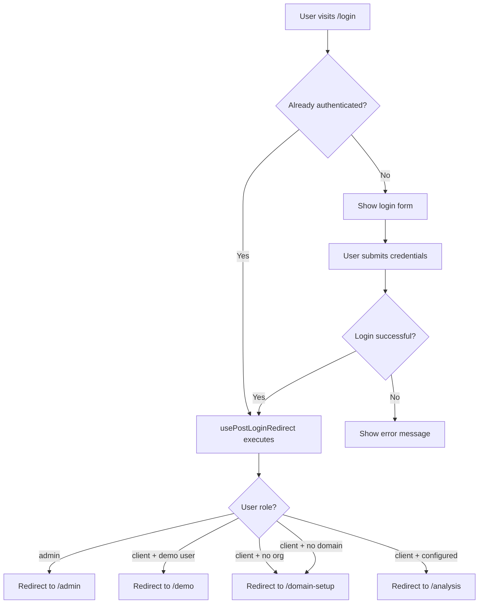

# Navigation Flow Documentation

## Overview

This document describes the complete navigation and routing structure of the PrompMetrics application.

## Route Categories

### 1. Public Routes (No Authentication Required)

| Route | Component | Description |
|-------|-----------|-------------|
| `/` | `Index` | Landing page with marketing content, accessible to all users |
| `/login` | `Login` | Login page with post-login redirect logic |
| `/signup` | `Signup` | User registration page |
| `/demo` | `Demo` | Public demo with sample data |
| `/changelog` | `Changelog` | Public changelog |

### 2. Protected Client Routes (Authentication + Client Role Required)

| Route | Component | Description |
|-------|-----------|-------------|
| `/analysis` | `Analysis` | Main analysis dashboard with live data |
| `/my-rank` | `MyRank` | Domain ranking analysis |
| `/domain-setup` | `DomainSetup` | Domain configuration page |
| `/home` | `Home` | Client home/dashboard |
| `/home/:slug` | `OrganizationHome` | Organization-specific dashboard (multi-org support) |

### 3. Protected Admin Routes (Authentication + Admin Role Required)

| Route | Component | Description |
|-------|-----------|-------------|
| `/admin` | `Admin` | Admin dashboard for user management |

### 4. Protected Generic Routes (Authentication Required, Any Role)

| Route | Component | Description |
|-------|-----------|-------------|
| `/test` | `Test` | Temporary fallback page for authenticated users |

### 5. Catch-All Route

| Route | Component | Description |
|-------|-----------|-------------|
| `*` | `NotFound` | 404 page for undefined routes |

## Authentication Flow

### Login Process



### Post-Login Redirect Logic

The post-login redirect is handled by:
- **Hook**: `usePostLoginRedirect` (src/hooks/usePostLoginRedirect.ts)
- **Service**: `redirectService.getPostLoginRedirect()` (src/services/redirectService.ts)
- **Used in**: `Login.tsx` page only

#### Redirect Decision Tree

```typescript
if (role === 'admin') → /admin
else if (role === 'client') {
  if (email === 'demo@example.com') → /demo
  else if (!organization_id) → /domain-setup
  else if (!organization.website_url) → /domain-setup
  else → /analysis
}
else → /test (fallback)
```

## Protected Route Behavior

The `ProtectedRoute` component (src/components/ProtectedRoute.tsx) handles:

1. **Loading State**: Shows loading spinner while checking authentication
2. **Unauthenticated**: Redirects to `/login`
3. **No Profile**: Shows loading with refresh option
4. **Role Mismatch**:
   - Admin accessing client route → **Allowed** (admin has access to all routes)
   - Client accessing admin route → Redirects to `/test`
   - Other mismatches → Redirects based on user's actual role

## Navigation Best Practices

### ✅ DO

- Use the `usePostLoginRedirect` hook **only** in `Login.tsx`
- Keep `Index.tsx` as a pure landing page without redirect logic
- Let authenticated users view the landing page if they navigate to `/`
- Use `ProtectedRoute` wrapper for all authenticated pages
- Specify `requiredRole` when a route is role-specific

### ❌ DON'T

- Add redirect logic to `Index.tsx` (it's a landing page, not a redirect hub)
- Use multiple redirect hooks in different pages
- Hardcode redirect paths - use `redirectService` instead
- Forget to wrap sensitive routes with `ProtectedRoute`

## Current Issues & Recommendations

### ✅ RESOLVED (Phase 1)
- ~~`/analysis` and `/my-rank` were unprotected~~ → **FIXED**: Now wrapped in `ProtectedRoute`
- ~~RLS policies too restrictive~~ → **FIXED**: Clients can now view their org's analyses

### 🔄 IN PROGRESS (Phase 2)
- ✅ Redundant redirect logic in `Index.tsx` removed
- ✅ Routes documented in `App.tsx`
- ✅ Navigation flow documented

### 📋 FUTURE IMPROVEMENTS (Phase 3-4)

1. **`/test` page**: Should be renamed to `/onboarding` or `/setup` with guided first steps
2. **`/home/:slug` route**: Currently unused - decide to implement or remove
3. **Breadcrumbs**: Add navigation breadcrumbs in client pages
4. **404 page**: Improve with contextual suggestions based on auth status
5. **Client navigation**: Create unified navigation component

## File Structure

```
src/
├── App.tsx                          # Route definitions with comments
├── components/
│   └── ProtectedRoute.tsx          # Authentication guard component
├── pages/
│   ├── Index.tsx                   # Landing page (no redirect logic)
│   ├── Login.tsx                   # Login page (uses usePostLoginRedirect)
│   ├── Analysis.tsx                # Protected client route
│   ├── MyRank.tsx                  # Protected client route
│   ├── Admin.tsx                   # Protected admin route
│   └── Test.tsx                    # Generic protected route
├── hooks/
│   └── usePostLoginRedirect.ts     # Post-login redirect hook
└── services/
    └── redirectService.ts          # Centralized redirect logic
```

## Security Notes

1. **RLS Policies**: All database tables have Row-Level Security enabled
2. **Role Validation**: User roles are stored in a separate `user_roles` table (not in profiles)
3. **Admin Privileges**: Admins can access all client routes
4. **Client Isolation**: Clients can only access their own organization's data
5. **Authentication Check**: Protected routes verify authentication before rendering

## Testing Checklist

- [ ] Unauthenticated user tries to access `/analysis` → Redirects to `/login`
- [ ] Unauthenticated user tries to access `/my-rank` → Redirects to `/login`
- [ ] Client logs in with no organization → Redirects to `/domain-setup`
- [ ] Client logs in with organization but no domain → Redirects to `/domain-setup`
- [ ] Client logs in with configured domain → Redirects to `/analysis`
- [ ] Admin logs in → Redirects to `/admin`
- [ ] Demo user logs in → Redirects to `/demo`
- [ ] Authenticated user visits `/` → Can view landing page
- [ ] Client tries to access `/admin` → Redirects to `/test`
- [ ] Admin tries to access `/analysis` → Access granted

---

**Last Updated**: Phase 2 implementation
**Status**: Redirect logic consolidated, routes documented
